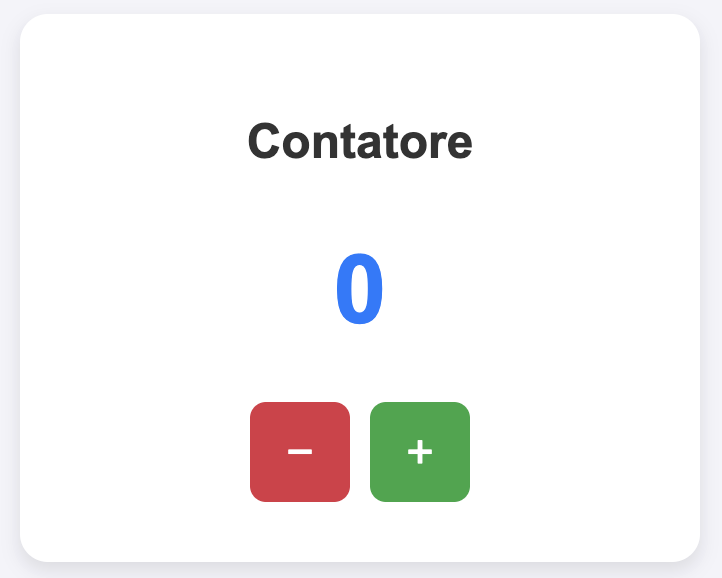

# Counter App 🚀

<p align="center">
  
</p>

Sviluppo di un'applicazione web interattiva con **Vanilla JavaScript** e **CSS3**, progettata per dimostrare la manipolazione dinamica del DOM senza l'utilizzo di framework o librerie esterni.

🔗 <strong>Prova subito l'applicazione online:</strong> <a href="https://aangelicaricci.github.io/javascript-project/">https://aangelicaricci.github.io/javascript-project/</a>

---

## 🔍 Panoramica del Progetto

Il progetto implementa un contatore dinamico che consente all'utente di incrementare o decrementare un valore numerico tramite i pulsanti dedicati. L'interfaccia viene **generata a runtime** tramite JavaScript puro.

---

## 🗂️ Struttura del Progetto

La struttura delle directory segue le best practices dello sviluppo web frontend:

```text
javascript-project/
│
├── README.md         
├── .gitignore          # Esclusione dei file di sistema (.DS_Store)
├── index.html          # Scheletro HTML principale
└── assets/
    ├── css/
    │   └── style.css       # Foglio di stile dell'interfaccia
    ├── js/
    │   └── script.js       # Logica e manipolazione dinamica del DOM
    └── img/
        └── contatore.png   # Screen dell'applicazione
```

---

## 🛠️ Architettura e Codice Sorgente

### 1. HTML (`index.html`)
Il file HTML non contiene elementi strutturali visibili, limitandosi ad importare il foglio di stile e lo script di inizializzazione.

```html
<!DOCTYPE html>
<html lang="it">
<head>
    <meta charset="UTF-8">
    <meta name="viewport" content="width=device-width, initial-scale=1.0">
    <title>Counter App</title>
    <!-- Percorso per lo script CSS -->
    <link rel="stylesheet" href="assets/css/style.css">
</head>
<body>
    <!-- Percorso per lo script Java Script -->
    <script src="assets/js/script.js"></script>
</body>
</html>
```

### 2. Stili (`css/style.css`)
Il design adotta un layout centrato con angoli arrotondati, ombreggiature morbide (`box-shadow`) e transizioni fluide al passaggio del mouse (`hover`).

```css
body {
    font-family: Arial, sans-serif;
    display: flex;
    justify-content: center;
    align-items: center;
    height: 100vh;
    margin: 0;
    background-color: #f4f4f9;
}

.counter-card {
    text-align: center;
    padding: 30px;
    background-color: #ffffff;
    border-radius: 14px;
    box-shadow: 0 4px 10px rgba(0, 0, 0.1, 0.1);
    width: 280px;
}

.counter-title {
    color: #333;
    margin-bottom: 20px;
    font-size: 24px;
}

.counter-display {
    font-size: 48px;
    font-weight: bold;
    color: #007BFF;
    margin-bottom: 20px;
}

.button-group {
    display: flex;
    gap: 10px;
    justify-content: center;
}

.btn {
    font-size: 24px;
    width: 50px;
    height: 50px;
    cursor: pointer;
    color: white;
    border: none;
    border-radius: 8px;
    transition: background-color 0.3s, opacity 0.3s;
}

.btn:hover {
    opacity: 0.8;
}

.btn-decrement {
    background-color: #DC3545;
}

.btn-increment {
    background-color: #28A745;
}
```

### 3. Logica JavaScript (`js/script.js`)
Lo script viene eseguito al caricamento completo del DOM (`DOMContentLoaded`). Si occupa di:
1. Inizializzare lo stato del contatore a `0`.
2. Creare dinamicamente gli elementi HTML (`div`, `h1`, `button`).
3. Assegnare le classi CSS corrispondenti.
4. Registrare gli event listener per gestire i click sui pulsanti di incremento e decremento.

```javascript
document.addEventListener("DOMContentLoaded", () => {
    // 1. Inizializzazione del contatore, sempre uguale a 0 al primo avvio
    let count = 0;

    // 2. Creazione del container principale
    const container = document.createElement("div");
    container.className = "counter-card";

    // 3. Creazione del titolo
    const title = document.createElement("h1");
    title.innerText = "Contatore";
    title.className = "counter-title";

    // 4. Creazione dell'elemento che mostra il numero
    const numberDisplayed = document.createElement("div");
    numberDisplayed.innerText = count;
    numberDisplayed.className = "counter-display";

    // 5. Creazione del contenitore per i pulsanti
    const buttonContainer = document.createElement("div");
    buttonContainer.className = "button-group";

    // Definizione del pulsante decrementa
    const btnDecrement = document.createElement("button");
    btnDecrement.innerText = "−";
    btnDecrement.className = "btn btn-decrement";

    // Definizione del pulsante incrementa
    const btnIncrement = document.createElement("button");
    btnIncrement.innerText = "+";
    btnIncrement.className = "btn btn-increment";

    // Definizione della funzione per aggiornare il valore
    const updateNumberDisplay = () => {
        numberDisplayed.innerText = count;;
    };

    // 6. Aggiunta degli EventListener per gestire i click
    btnIncrement.addEventListener("click", () => {
        count++;
        updateNumberDisplay();
    });

    btnDecrement.addEventListener("click", () => {
        count--;
        updateNumberDisplay();
    });

    // 7. Inserimento dei vari elementi nel DOM
    buttonContainer.appendChild(btnDecrement);
    buttonContainer.appendChild(btnIncrement);

    container.appendChild(title);
    container.appendChild(numberDisplayed);
    container.appendChild(buttonContainer);

    document.body.appendChild(container);
});
```

---

## 🚀 Come Eseguire l'Applicazione

1. Clona il repository in locale:
   ```bash
   git clone https://github.com/aangelicaricci/javascript-project.git
   ```
2. Apri la cartella del progetto nel tuo editor preferito (es. **VS Code**).
3. Apri il file `index.html` direttamente nel browser oppure utilizza l'estensione **Live Server** di VS Code per un aggiornamento in tempo reale.

---

## ⚙️ Requisiti Tecnici
* **JavaScript Puro (Vanilla JS)**: Nessun framework o libreria esterna richiesta.
* **Manipolazione Dinamica**: Tutti gli elementi visivi sono iniettati tramite API del DOM (`document.createElement`).
* **Compatibilità**: Funziona su qualsiasi browser moderno.